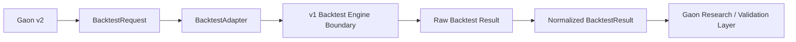

# Sprint 41 v1 Backtest Adapter Foundation

Status: Implemented

Sprint 41 defines the safe adapter boundary that lets Gaon v2 request a v1 backtest and normalize the result. The real v1 backtest engine is not required for automated tests. Sprint 41 defines the safe adapter boundary and deterministic integration path.

## Architecture

The public repository does not copy the v1 backtest engine. It depends on a stable adapter contract and deterministic fake/local-safe implementations only.

## Contracts

- `BacktestRequest`
- `BacktestStrategyRef`
- `BacktestDatasetRef`
- `BacktestPeriod`
- `BacktestExecutionContext`
- `BacktestResult`
- `BacktestMetrics`
- `BacktestTradeSummary`
- `BacktestStatus`
- `BacktestAdapter`
- `FakeBacktestAdapter`
- `LocalProcessBacktestAdapter`

Requests refer to strategies by stable identifiers such as `turtle_v5` or `turtle_v6_candidate`. They do not embed executable code and do not accept unrestricted script paths.

## v1 Invocation Boundary

`LocalProcessBacktestAdapter` is designed for a future fixed-entrypoint v1 integration using structured JSON request/response. The sprint validates:

- bounded timeout
- bounded output size
- exit-code validation
- invalid JSON handling
- no arbitrary shell execution
- no user-supplied executable paths
- no unrestricted command interpolation

Automated tests use fakes and injected invokers only.

## Reproducibility

Each request exposes a stable fingerprint derived from:

- strategy reference
- parameters
- dataset reference
- period
- engine version

The fingerprint is persisted with requests and results for later Validation Engine and Champion/Challenger work.

## Schema

Runtime schema v12 adds:

- `backtest_requests`
- `backtest_results`

The migration is forward-only and preserves existing data.

## Boundaries

Sprint 41 does not implement Champion/Challenger ranking, strategy promotion, active strategy switching, paper trading promotion, live strategy deployment, KIS integration, MyMoneyGuard integration, automatic trading, or automatic approval.
