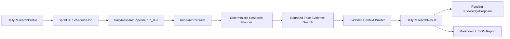

# Sprint 39 Daily Research Pipeline

Status: Implemented

Sprint 39 adds the Daily Research business pipeline on top of the existing Sprint 38 scheduled automation layer. It does not introduce a second scheduler.

## Scope

Included:

- `DailyResearchTopic`, `DailyResearchProfile`, `DailyResearchRun`, `DailyResearchRunStatus`, and `DailyResearchResult`
- durable SQLite profile and run storage
- schema v10 migration from scheduler schema v9
- deterministic profile list order by priority and profile id
- enable and disable workflow
- scheduling through `ScheduledJobRepository`
- due execution through `DailyResearchPipeline.run_due`
- duplicate run protection by profile and timestamp
- bounded deterministic evidence search, context building, synthesis, markdown/json report output, and pending-review knowledge proposal creation
- durable event store integration
- runtime metrics integration
- CLI inspection and execution commands

Not included:

- live Telegram delivery
- email delivery
- Notion sync
- GitHub polling
- live market data
- Trading Adapter execution
- broker, KIS, or MyMoneyGuard access
- external AI provider calls
- vector DB or embeddings
- automatic knowledge approval or policy change
- shell or plugin execution

## Flow



## Safety Boundaries

The pipeline is free-only and deterministic in this sprint. It preserves citations, unknowns, risks, and contradiction references. Knowledge proposals are created with `pending_review` status only; trusted knowledge promotion remains outside this sprint and requires the existing approval workflow.

Disabled profiles are skipped. Failed profiles are isolated into failed runs and do not crash due execution. Duplicate runs at the same profile/timestamp are not inserted twice.

## CLI

```powershell
py -3.11 -m gaon.runtime.cli daily-research-create --db runtime.sqlite --profile-id korea-open --topic "Korea Open" --query "KOSPI opening risk" --next-run-at "2026-07-18T00:00:00Z"
py -3.11 -m gaon.runtime.cli daily-research-list --db runtime.sqlite
py -3.11 -m gaon.runtime.cli daily-research-show --db runtime.sqlite korea-open
py -3.11 -m gaon.runtime.cli daily-research-run --db runtime.sqlite --due --now "2026-07-18T00:00:00Z"
py -3.11 -m gaon.runtime.cli daily-research-report --db runtime.sqlite korea-open --format markdown
py -3.11 -m gaon.runtime.cli daily-research-report --db runtime.sqlite korea-open --format json
py -3.11 -m gaon.runtime.cli daily-research-disable --db runtime.sqlite korea-open
py -3.11 -m gaon.runtime.cli daily-research-enable --db runtime.sqlite korea-open
```

## Current Limitations

Sprint 39 uses deterministic fake evidence providers so automated tests never require network access. Scheduler cadence persistence remains the Sprint 38 one-shot bounded execution model: completed jobs are disabled after success. Recurring scheduling and Telegram delivery are separate future work.
