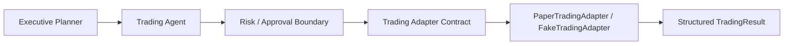

# Sprint 40 Trading Adapter Foundation

Status: Implemented

Sprint 40 defines the safe trading execution boundary for Gaon v4.0. Live trading is not implemented.

## Architecture

The implementation reuses the existing broker-free adapter package, Executive Planner, Agent Dispatcher, Event Store, Runtime Metrics, and SQLite runtime migration flow. It does not create a parallel trading subsystem.

## Included

- `TradingIntent`
- `TradingAction`
- `OrderSide`
- `OrderType`
- `TradingRequest`
- `TradingDecision`
- `TradingExecutionContext`
- `TradingResult`
- `TradingStatus`
- `AccountSnapshot`
- `PositionSnapshot`
- `TradingRiskPolicy`
- `TradingExecutionService`
- `SQLiteTradingRepository`
- `FakeTradingAdapter`
- `PaperTradingAdapter`

Supported intents are non-live:

- `analyze`
- `simulate_buy`
- `simulate_sell`
- `cancel_simulated_order`

Live intents are blocked and require explicit human review. There is no live adapter implementation.

## Risk Guardrails

The deterministic risk policy checks:

- quantity must be positive for simulated orders
- symbol format must be valid
- max notional limit
- max position limit
- unsupported order type
- duplicate request or idempotency key
- disabled adapter
- live execution forbidden

Risk failures return structured `TradingResult` values. They do not crash the runtime.

## Events

The service can emit:

- `TradingRequestCreated`
- `TradingRequestValidated`
- `TradingRequestRejected`
- `PaperTradeStarted`
- `PaperTradeCompleted`
- `PaperTradeFailed`
- `TradingExecutionBlocked`

## Metrics

The service can record:

- `gaon_trading_requests_total`
- `gaon_trading_rejections_total`
- `gaon_paper_trades_total`
- `gaon_paper_trade_failures_total`
- `gaon_trading_execution_blocked_total`

## Persistence

Runtime schema v11 adds:

- `trading_requests`
- `trading_results`

The migration is forward-only and preserves existing data.

## Boundaries

Live trading is not implemented. Sprint 40 does not include KIS REST, KIS WebSocket, broker authentication, real account access, real balance query, real order execution, automatic trading, automatic approval, MyMoneyGuard integration, live market data, Telegram trading commands, paid-provider fallback, or unrestricted shell execution.
